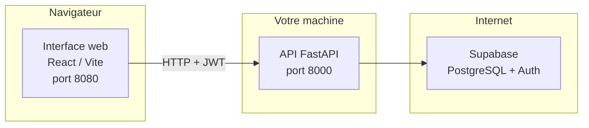

# Guide d’utilisation du dépôt — du zéro à l’aisance

Ce guide s’adresse à **toute personne** qui découvre le projet : développeur débutant, revenant après une pause, ou simplement perdu dans les dossiers. **Aucun prérequis** n’est supposé : suivez les étapes **dans l’ordre** la première fois.

**Ce que vous y trouverez :** installer le projet, le lancer chaque jour, comprendre où toucher au code, utiliser Git sans stress, ouvrir une Pull Request, et dépanner les erreurs les plus fréquentes.

Si un mot vous bloque, allez au [mini-glossaire](#18-mini-glossaire).

---

## Table des matières

1. [Les trois idées à retenir avant tout](#1-les-trois-idées-à-retenir-avant-tout)
2. [À quoi sert ce projet (en une image)](#2-à-quoi-sert-ce-projet-en-une-image)
3. [Par où commencer selon votre situation](#3-par-où-commencer-selon-votre-situation)
4. [Ce dont vous avez besoin sur votre machine](#4-ce-dont-vous-avez-besoin-sur-votre-machine)
5. [Première installation (une seule fois)](#5-première-installation-une-seule-fois)
6. [Chaque jour : lancer le site en local](#6-chaque-jour--lancer-le-site-en-local)
7. [Vérifier que tout fonctionne](#7-vérifier-que-tout-fonctionne)
8. [Une fois l’interface ouverte : à quoi s’attendre](#8-une-fois-linterface-ouverte--à-quoi-sattendre)
9. [Modifier du code sans se perdre](#9-modifier-du-code-sans-se-perdre)
10. [Tests et qualité (sans paniquer)](#10-tests-et-qualité-sans-paniquer)
11. [Git : branches, commits et messages](#11-git--branches-commits-et-messages)
12. [Pull Request : faire intégrer votre travail](#12-pull-request--faire-intégrer-votre-travail)
13. [Ce qui se passe quand vous poussez du code (CI)](#13-ce-qui-se-passe-quand-vous-poussez-du-code-ci)
14. [Utiliser Cursor ou une autre IA](#14-utiliser-cursor-ou-une-autre-ia)
15. [Déploiement (production)](#15-déploiement-production)
16. [Ça ne marche pas ?](#16-ça-ne-marche-pas-)
17. [Questions fréquentes (FAQ)](#17-questions-fréquentes-faq)
18. [Mini-glossaire](#18-mini-glossaire)
19. [Aller plus loin (liens)](#19-aller-plus-loin-liens)

---

## 1. Les trois idées à retenir avant tout

| Idée | Pourquoi c’est important |
|------|---------------------------|
| **Deux programmes tournent en local** | Un pour l’**interface** (navigateur), un pour l’**API** (serveur). Les deux doivent être lancés pour travailler normalement. |
| **Les secrets ne vont pas sur Git** | Fichiers `.env`, mots de passe, clés API : uniquement sur **votre machine** ou dans les secrets de l’équipe — **jamais** dans un commit. |
| **Le fichier `.env` est votre configuration locale** | Backend et frontend ont chacun le leur. Sans variables correctes (surtout Supabase), l’app peut démarrer mais la **connexion** ou les **données** échoueront. |

---

## 2. À quoi sert ce projet (en une image)

Le dépôt **EYWAI** contient un **SIRH** (logiciel de gestion des ressources humaines) découpé en deux parties qui dialoguent par le réseau :



| Morceau | Rôle simple | Dossier |
|--------|-------------|---------|
| **Interface** | Écrans, boutons, ce que l’utilisateur voit | `frontend/` |
| **API** | Règles métier, calculs, accès aux données | `backend/` |

Les comptes utilisateurs et une grande partie des données passent par **Supabase** (PostgreSQL + authentification). Sans projet Supabase correctement configuré côté équipe, certaines fonctions ne marcheront pas — ce n’est pas un bug de votre installation, c’est une **dépendance** au projet cloud.

---

## 3. Par où commencer selon votre situation

- **Je veux juste faire tourner le projet une fois** → sections [5](#5-première-installation-une-seule-fois), [6](#6-chaque-jour--lancer-le-site-en-local), [7](#7-vérifier-que-tout-fonctionne).
- **Je dois modifier du code** → ajoutez [9](#9-modifier-du-code-sans-se-perdre), [10](#10-tests-et-qualité-sans-paniquer), [11](#11-git--branches-commits-et-messages), [12](#12-pull-request--faire-intégrer-votre-travail).
- **Je suis bloqué par une erreur** → [16](#16-ça-ne-marche-pas-) puis [17](#17-questions-fréquentes-faq).
- **J’utilise l’IA (Cursor, etc.)** → [14](#14-utiliser-cursor-ou-une-autre-ia).

---

## 4. Ce dont vous avez besoin sur votre machine

| Outil | Rôle | Où le télécharger |
|-------|------|-------------------|
| **Git** | Récupérer le code, créer des branches | [git-scm.com](https://git-scm.com) |
| **Python 3.11 ou plus** | Lancer l’API | [python.org](https://www.python.org) |
| **Node.js** (idéalement **18+**, **20+** recommandé pour coller aux environnements récents) | Lancer l’interface et les outils à la racine du dépôt | [nodejs.org](https://nodejs.org) |
| **Un éditeur** | Modifier les fichiers | VS Code, Cursor, etc. |

**Optionnel mais presque indispensable en pratique :** accès aux **variables d’environnement** fournies par l’équipe (Supabase : URL, clés, etc.). Demandez un **exemple de `.env`** ou un document interne — **sans secrets dedans** dans le dépôt public.

**Windows :** les commandes ci-dessous utilisent `source venv/bin/activate` (macOS / Linux). Sous Windows, remplacez par `venv\Scripts\activate`.

---

## 5. Première installation (une seule fois)

### 5.1 Télécharger le code

Remplacez l’URL par celle de **votre** dépôt.

```bash
git clone <URL_DU_DEPOT>
cd EYWAI
```

(Le dossier peut s’appeler autrement selon ce que vous avez choisi au `clone`.)

### 5.2 Outils Git à la racine du dépôt (recommandé)

À la **racine** (là où se trouve le `package.json` qui configure Husky) :

```bash
npm install
```

Cela active **Husky** et **commitlint** : à chaque `git commit`, le **message** est vérifié (format *Conventional Commits*). Si le commit est refusé, l’erreur indique quoi corriger. Détail des types et scopes : **[CONTRIBUTING.md](CONTRIBUTING.md)**. Vue d’ensemble des hooks + GitHub Actions (pour débuter) : **[.github/workflows/GUIDE_SIMPLE.md](.github/workflows/GUIDE_SIMPLE.md)**.

Si les hooks ne semblent pas actifs après installation :

```bash
npx husky
```

### 5.3 Backend (Python)

```bash
cd backend
python -m venv venv
source venv/bin/activate
pip install -r requirements.txt
```

Créez un fichier **`.env`** dans `backend/` (au même niveau que `requirements.txt`). **Ne le commitez jamais.** La liste des variables attendues est décrite dans **[backend/README.md](backend/README.md)** (par ex. `SUPABASE_URL`, clés Supabase).

**Redis / tâches en arrière-plan** : utile surtout si vous lancez des **workers** (ex. Dramatiq). Pour un premier usage « API + interface », ce n’est souvent **pas** nécessaire — demandez à l’équipe si votre tâche l’exige.

### 5.4 Frontend (Node)

```bash
cd ../frontend
npm install
```

Créez un fichier **`.env`** dans `frontend/` avec au minimum :

```env
VITE_API_URL=http://localhost:8000
```

Ainsi le navigateur sait où envoyer les requêtes vers l’API en local.

### 5.5 Base de données

Le schéma SQL et la sécurité au niveau des lignes (**RLS**) se configurent sur **Supabase** selon le processus de l’équipe. Ce dépôt ne remplace pas ce travail : sans base alignée, l’application peut **démarrer** mais certaines **pages ou actions** échoueront.

### 5.6 (Optionnel) Pre-commit Python

Pour analyser le Python du backend avant commit (selon configuration du dépôt) :

```bash
pip install pre-commit
pre-commit install
```

---

## 6. Chaque jour : lancer le site en local

Il vous faut **deux fenêtres de terminal** ouvertes en même temps.

**Terminal 1 — API (backend)**

```bash
cd chemin/vers/EYWAI/backend
source venv/bin/activate
uvicorn app.main:app --reload --host 0.0.0.0 --port 8000
```

**Terminal 2 — Interface (frontend)**

```bash
cd chemin/vers/EYWAI/frontend
npm run dev
```

| Quoi | Adresse habituelle |
|------|-------------------|
| Site web | [http://localhost:8080](http://localhost:8080) (voir `frontend/vite.config.ts` si le port change) |
| API | [http://localhost:8000](http://localhost:8000) |
| Documentation interactive de l’API (Swagger) | [http://localhost:8000/docs](http://localhost:8000/docs) |

Pour **arrêter** : dans chaque terminal, `Ctrl+C`.

---

## 7. Vérifier que tout fonctionne

1. Ouvrir [http://localhost:8000/health](http://localhost:8000/health) : une réponse JSON indique que l’API répond (souvent un statut « ok »).
2. Ouvrir [http://localhost:8080](http://localhost:8080) : la page d’accueil du front doit s’afficher.
3. Si la **connexion** ou les **données** posent problème : vérifiez les `.env` (backend + frontend) et la configuration Supabase (projet actif, bonnes clés, RLS).

---

## 8. Une fois l’interface ouverte : à quoi s’attendre

Ce projet est un **SIRH multi-entreprises** : selon votre **rôle** (Super Admin, Admin, RH, Manager, Salarié, etc.), vous ne verrez **pas les mêmes menus**. C’est normal : les droits sont gérés côté application et base de données.

- La **connexion** repose en général sur **Supabase Auth** (email / mot de passe ou flux défini par l’équipe). Utilisez un compte de **test** fourni par l’équipe si vous n’avez pas encore de compte production.
- Si vous voyez des **erreurs 401** ou des écrans vides alors que l’API et le front répondent, le problème vient souvent des **variables d’environnement**, du **compte utilisateur**, ou des **politiques de sécurité** (RLS) sur la base — pas du simple fait d’avoir lancé `npm run dev`.

Pour une vue produit plus large (fonctionnalités paie, absences, etc.), voir le **[README.md](README.md)** à la racine.

---

## 9. Modifier du code sans se perdre

| Vous voulez toucher à… | Regardez plutôt… |
|------------------------|------------------|
| Pages, boutons, textes à l’écran | `frontend/src/` (souvent `pages/`, `components/`) |
| Règles métier, endpoints HTTP, accès données | `backend/app/` (détail : **[backend/app/README.md](backend/app/README.md)**) |

Avec `--reload` (backend) et `npm run dev` (frontend), **beaucoup de changements se rechargent tout seuls** : enregistrez le fichier, puis rafraîchissez le navigateur si besoin.

**Règle simple :** une demande = changements **ciblés**. Évitez les gros remaniements non demandés.

---

## 10. Tests et qualité (sans paniquer)

Avant une Pull Request, il est recommandé de lancer au minimum :

**Backend** (venv activé, depuis le dossier `backend/`) :

```bash
pytest
```

Pour aller plus vite en excluant les tests dits « e2e » (plus lents ou plus dépendants de l’environnement) :

```bash
pytest -m "not e2e"
```

**Frontend** (depuis `frontend/`) :

```bash
npm run lint
npm run build
```

S’il n’y a pas de suite de tests unitaires front standard dans le projet, le README du front le précise.

---

## 11. Git : branches, commits et messages

### Routine courte

1. Mettre à jour la branche principale : `git checkout main` puis `git pull`.
2. Créer une branche de travail : `git checkout -b feature/mon-sujet`.
3. Enregistrer par petits lots : `git status` → `git add …` → `git commit -m "…"`.
4. Envoyer : `git push -u origin feature/mon-sujet`.

Guide plus détaillé avec exemples de sorties terminal : **[git/README.md](git/README.md)**.

### Forme du message (rappel)

Modèle : **`type(scope): courte description`**

- **Types** courants : `feat`, `fix`, `chore`, `docs`, etc.
- **Scope** : **facultatif**. S’il est présent, il doit être l’un de : `payroll`, `auth`, `frontend`, `infra`, `api`, `ci`.

### Exemples qui passent souvent la vérification

```text
feat(frontend): ajouter le lien vers la fiche salarié
fix(api): renvoyer 422 pour une entrée de paie invalide
fix(payroll): corriger les jours ouvrés sur un mois partiel
chore(ci): mettre en cache les dépendances npm
docs: documenter les variables Supabase dans le README
```

### Exemples qui échouent souvent

```text
mise à jour du front                    ← pas de type au début
feat(ui): bouton                        ← scope "ui" non autorisé → utiliser frontend
WIP                                     ← pas au bon format
```

Corriger le **dernier** message **avant** le premier `push` :

```bash
git commit --amend -m "fix(frontend): libellé du bouton Annuler"
```

### Une intention par commit

- **Un commit = une idée claire** : plus facile à relire, à annuler et à fusionner.
- Évitez le tout-en-un (refactor + fonctionnalité + doc) sauf **demande explicite**.
- Même logique si une **IA** prépare les commits : demandez des **commits découpés**.

Règles complètes : **[CONTRIBUTING.md](CONTRIBUTING.md)**.

---

## 12. Pull Request : faire intégrer votre travail

Sur GitHub (ou votre forge), ouvrez une **Pull Request** de votre branche vers la branche cible (`main`, etc.). Un **modèle** peut s’afficher : remplissez la **checklist** (tests, sécurité des données, capture d’écran si l’interface change).

Rappels souvent présents dans **[CONTRIBUTING.md](CONTRIBUTING.md)** :

- L’**IA peut aider** à la revue ; un **humain** valide et fusionne en général.
- **Au moins une approbation humaine** avant fusion est une pratique courante.

---

## 13. Ce qui se passe quand vous poussez du code (CI)

Le dépôt peut inclure des **GitHub Actions** qui tournent sur les **Pull Requests** et parfois sur `main` :

- vérification de **secrets** dans l’historique (ex. gitleaks) ;
- **tests** backend, **lint** front, **build** du front ;
- autres contrôles selon la configuration actuelle dans `.github/workflows/`.

Si une étape est **rouge**, ouvrez le détail du workflow : le message d’erreur indique souvent la marche à suivre (test qui échoue, lint, etc.). Ce n’est pas une punition : c’est un **filet de sécurité** pour toute l’équipe.

---

## 14. Utiliser Cursor ou une autre IA

### Contexte automatique

Des règles Cursor peuvent se trouver dans **`.cursor/rules/`** : elles s’appliquent quand vous travaillez sous `backend/` ou `frontend/` (conventions, pas de gros refactors gratuits, textes visibles en français pour l’utilisateur, etc.).

### Fichiers utiles à attacher au chat (`@`)

- **`@AGENTS.md`** — stack, commandes, interdits (secrets, SQL hors processus).
- **`@backend/app/README.md`** — architecture de l’API.
- **`@DEPLOIEMENT.md`** — déploiement.

### Prompts d’agents (Feature, Review, Sécurité, Docs, Release)

Liste et emplacement : **[.github/prompts/agents/README.md](.github/prompts/agents/README.md)**.

---

## 15. Déploiement (production)

Les environnements de **production** (Cloud Run, variables, secrets) sont décrits dans **[DEPLOIEMENT.md](DEPLOIEMENT.md)**. Ce n’est en général **pas** la première chose à lire pour faire tourner le projet en local.

---

## 16. Ça ne marche pas ?

| Symptôme | Piste |
|----------|--------|
| `python` ou `pip` introuvable | Réinstaller Python 3.11+ et rouvrir le terminal. |
| `ModuleNotFoundError` au lancement du backend | Venv **activé** ? `pip install -r requirements.txt` dans `backend/` ? |
| Le front affiche des erreurs réseau | Backend lancé ? `VITE_API_URL=http://localhost:8000` dans `frontend/.env` ? |
| Erreurs 401 / pas de données | Variables Supabase dans `backend/.env` ? Compte de test ? RLS / projet Supabase ? |
| Commit refusé par un hook | Souvent le **format du message** : voir [section 11](#11-git--branches-commits-et-messages) et [CONTRIBUTING.md](CONTRIBUTING.md). |
| Pre-commit bloque sur du Python | Lisez le message : souvent **Ruff** sur `backend/**/*.py` ; corrigez ou lancez les outils indiqués. |
| Port déjà utilisé | Fermez l’autre programme ou changez le port (Vite / uvicorn). |
| Conflit Git (« conflict ») | `git status` ; `git pull` ou rebase selon l’équipe. **Évitez** `git push --force` sans accord. |
| Workflow CI rouge sur GitHub | Ouvrez l’onglet **Actions** et lisez la première erreur utile (souvent un test ou un lint). |

Autres pistes : section **Problèmes courants** du **[README.md](README.md)** principal.

---

## 17. Questions fréquentes (FAQ)

**Dois-je lancer le backend avant le frontend ?**  
L’ordre n’a pas d’import pour *démarrer* les deux processus. En revanche, sans backend, le frontend affichera des erreurs dès qu’il appellera l’API.

**Pourquoi deux ports (8080 et 8000) ?**  
Ce sont deux programmes différents : le **serveur de développement** du front (Vite) et l’**API** FastAPI. Chacun écoute sur son port.

**Je n’ai pas les clés Supabase : je peux quand même coder ?**  
Oui pour une partie du code (logique pure, interface statique). Pour tout ce qui touche **auth** ou **données réelles**, vous aurez besoin des variables ou d’un environnement de test partagé par l’équipe.

**C’est quoi la différence entre `npm install` à la racine et dans `frontend/` ?**  
La **racine** installe les outils **Git** (hooks de message de commit). Le dossier **`frontend/`** installe les **dépendances de l’interface** React. Les deux sont utiles, pour des rôles différents.

**Où sont les « vrais » utilisateurs et données ?**  
En production, sur l’infrastructure gérée par l’équipe (voir [DEPLOIEMENT.md](DEPLOIEMENT.md)). En local, vous utilisez en général un **projet Supabase de test** ou des données fictives selon la politique du projet.

---

## 18. Mini-glossaire

| Terme | Signification courte |
|-------|----------------------|
| **API** | Programme qui répond à des requêtes HTTP (souvent en JSON). |
| **Backend** | Partie serveur (ici Python / FastAPI). |
| **CI** | *Continuous Integration* : vérifications automatiques à chaque changement poussé. |
| **Commit** | Instantané enregistré de vos fichiers avec un message. |
| **Frontend** | Partie qui s’exécute dans le navigateur (ici React / Vite). |
| **Branche** | Ligne de développement parallèle (ex. `feature/…`). |
| **Hook** | Script lancé automatiquement par Git (ex. vérifier le message de commit). |
| **JWT** | Jeton d’authentification souvent utilisé après connexion. |
| **Pull Request (PR)** | Demande pour fusionner votre branche dans une branche principale. |
| **RLS** | *Row Level Security* : règles PostgreSQL pour définir qui peut lire ou modifier quelles lignes. |
| **Supabase** | Service qui fournit souvent PostgreSQL + authentification pour ce projet. |
| **venv** | Environnement Python isolé (souvent le dossier `venv/` sous `backend/`). |
| **Conventional Commits** | Convention de titre de commit (`feat:`, `fix(api):`, etc.). |

---

## 19. Aller plus loin (liens)

| Sujet | Document |
|--------|----------|
| Vue d’ensemble produit et architecture | [README.md](README.md) |
| Stack et commandes (référence rapide) | [AGENTS.md](AGENTS.md) |
| Commits, PR, revue | [CONTRIBUTING.md](CONTRIBUTING.md) |
| Déploiement (ex. Cloud Run) | [DEPLOIEMENT.md](DEPLOIEMENT.md) |
| Architecture détaillée de l’API | [backend/app/README.md](backend/app/README.md) |
| Git pas à pas | [git/README.md](git/README.md) |

---

En cas de blocage, notez **le message d’erreur complet** et **la commande exacte** que vous avez lancée : c’est ce qui permet à une collègue, un collègue ou un support de vous aider le plus vite.
